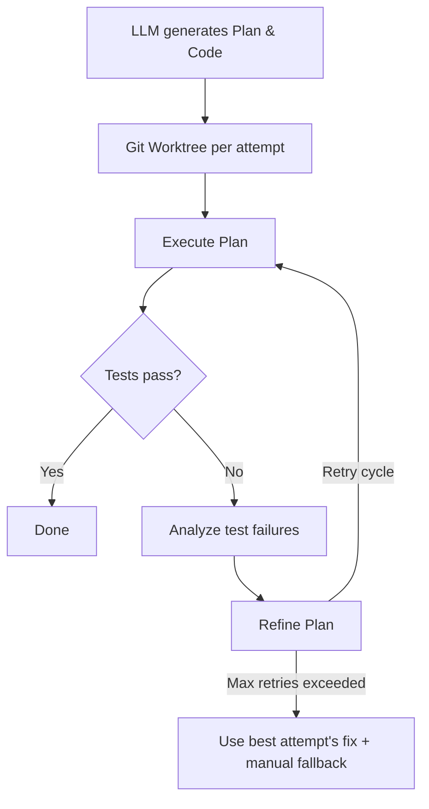

# linear-opencode-agent

A Linear AI agent that codes on assigned issues and assists when mentioned in comments. It bridges Linear's AgentSession protocol to an [opencode](https://opencode.ai) server that does the actual coding, deployed as a Cloudflare Worker plus a remote opencode server.

## How it works

Two flows through the same pipeline:

- **Delegation flow** (issue assigned to agent): Parses an `<!-- openspec-change: <name> -->` marker from the issue description, creates branch `feat/<name>`, drives an opencode session to edit code, and opens a PR. Requires `openspec/changes/<name>/` to exist in the target repo or it aborts.
- **Mention flow** (agent @-mentioned in a comment): Runs a read-only opencode session restricted by a tool whitelist that disables `bash`, `edit`, `write`, and `apply_patch`. Answers with a `response` activity. No branch, no git mutations, no PR.

In both flows, the Runner tracks the result as a Linear AgentSession with AgentActivities (thought, action, error, response) and can optionally expand into a Self-Healing Pipeline:



1. Linear fires a webhook → Worker's `fetch()` handler verifies HMAC-SHA256, sets a **session marker** KV entry to deduplicate `created` webhooks, and enqueues a job.
2. Cloudflare Queue consumer picks up the job, creates a Linear SDK client (OAuth) and an opencode client (Basic Auth).
3. For delegation: extracts the OpenSpec change marker, verifies the directory exists, builds a coding prompt, creates a new opencode session, fires the prompt async, and polls every 5s.
4. The **translator** maps each opencode Part into a Linear AgentActivity emission so progress is visible in the Linear UI.
5. On completion: extracts the PR URL from the final response and attaches it to the AgentSession.

## Architecture

```
Linear ──webhook──▶ Cloudflare Worker ──queue──▶ Cloudflare Queue consumer
                                                        │
                                                        ▼
                                            opencode server on Railway
```

| Component | Role |
|-----------|------|
| **Cloudflare Worker** (`fetch` handler) | Receives Linear webhooks, verifies HMAC-SHA256 signatures, writes session markers, enqueues jobs. Responds in <1s. |
| **Cloudflare Queue** (consumer) | Owns one coding job's full lifetime. Polls opencode every 5s, translates parts into Linear activities. Serialized (`max_concurrency=1`) to avoid concurrent git branch conflicts. |
| **Railway opencode server** | Runs the actual coding session. Deployed with `serverless=false` (keeps state warm) and `ENABLE_OH_MY_OPENCODE=false` (controlled plugin behavior). One Railway service per target repo. |
| **KV: LINEAR_TOKENS** | Stores OAuth tokens per Linear workspace. |
| **KV: SESSION_STATE** | Session markers (dedup guards, written before enqueue) and session maps (opencode session IDs, 30-day TTL). |
| **KV: REPO_MAP** | Maps Linear project IDs to Railway repository path segments. |

## Prerequisites

- A Cloudflare account with Workers and Queues enabled.
- A Linear OAuth application.
- A Railway account with the [opencode Railway template](https://github.com/opencode-ai/opencode-railway-template) deployed for each repo you want the agent to work on.

## Local development

```bash
pnpm install
pnpm dev          # wrangler dev
pnpm test         # vitest
pnpm run typecheck
pnpm lint         # oxlint
pnpm format       # oxfmt
```

## Configuration

Edit `wrangler.jsonc` and fill in your IDs:

```jsonc
{
  "$schema": "node_modules/wrangler/config-schema.json",
  "name": "linear-opencode-agent",
  "main": "src/index.ts",
  "compatibility_date": "2024-09-23",
  "compatibility_flags": ["nodejs_compat"],
  "observability": { "enabled": true },
  "kv_namespaces": [
    { "binding": "LINEAR_TOKENS", "id": "<your-linear-tokens-kv-id>" },
    { "binding": "SESSION_STATE", "id": "<your-session-state-kv-id>" }
  ],
  "queues": {
    "producers": [
      { "binding": "CODING_TASKS", "queue": "linear-opencode-agent-tasks" }
    ],
    "consumers": [
      {
        "queue": "linear-opencode-agent-tasks",
        "max_batch_size": 1,
        "max_concurrency": 1,
        "max_batch_timeout": 30
      }
    ]
  },
  "vars": {
    "LINEAR_CLIENT_ID": "<your-linear-client-id>",
    "WORKER_URL": "https://linear-opencode-agent.<your-subdomain>.workers.dev",
    "OPENCODE_SERVER_URL": "https://<your-opencode-railway-service>.up.railway.app"
  }
}
```

Set secrets via Wrangler (never commit these):

```bash
wrangler secret put LINEAR_CLIENT_SECRET
wrangler secret put LINEAR_WEBHOOK_SECRET
wrangler secret put OPENCODE_SERVER_PASSWORD
```

### Environment variables and secrets

| Name | Type | Purpose |
|------|------|---------|
| `LINEAR_CLIENT_ID` | var | Linear OAuth app client ID. |
| `LINEAR_CLIENT_SECRET` | secret | Linear OAuth app client secret. |
| `LINEAR_WEBHOOK_SECRET` | secret | Signing secret for verifying Linear webhooks. |
| `WORKER_URL` | var | Public URL of this Worker (used for OAuth redirect). |
| `OPENCODE_SERVER_URL` | var | Base URL of the Railway opencode server. The worker appends `/{repositoryName}/` per issue. |
| `OPENCODE_SERVER_PASSWORD` | secret | HTTP Basic Auth password shared across all opencode servers. |
| `LINEAR_TOKENS` | KV | Stores OAuth tokens per Linear workspace. |
| `SESSION_STATE` | KV | Session markers and session maps. |
| `REPO_MAP` | KV | Maps `repo:<organizationId>:<projectId>` to a repository name string. |
| `CODING_TASKS` | Queue | Work queue for AgentSession jobs. |

## Linear OAuth setup

1. Create an OAuth application in Linear at **Settings → API → OAuth application**.
2. Add the redirect URL: `https://<your-worker-url>/oauth/callback`.
3. Request the `issues`, `comments`, `write`, `app:assignable`, and `app:mentionable` scopes.
4. Copy the Client ID and Client Secret into the Worker config.
5. Authorize the agent for a workspace by visiting:

   ```
   https://<your-worker-url>/oauth/authorize?workspace_id=<linear-organization-id>
   ```

   The token is stored in `LINEAR_TOKENS` KV and refreshed automatically.

## Linear webhook setup

Create a webhook in Linear that points to:

```
https://<your-worker-url>/webhook
```

Subscribe to **Agent session events**. Linear will send a signing secret; store it as `LINEAR_WEBHOOK_SECRET`.

## Railway opencode server setup

For each repository you want the agent to edit:

1. Deploy the [opencode-railway-template](https://github.com/opencode-ai/opencode-railway-template).
2. Set `serverless=false` in the Railway environment.
3. Set `ENABLE_OH_MY_OPENCODE=false`.
4. Provide `GH_TOKEN` with permissions to clone the repo, push branches, and open PRs.
5. Configure the startup hook to clone the target repo into the service's working directory.
6. Set a strong `OPENCODE_SERVER_PASSWORD` and copy it into the Worker's `OPENCODE_SERVER_PASSWORD` secret.

The Worker routes each issue to the correct repository path on the Railway service configured in `OPENCODE_SERVER_URL`. Populate `REPO_MAP` with one entry per Linear project you want the agent to handle.

### Populating REPO_MAP

For each Linear project, add a KV entry where the key is `repo:<organizationId>:<projectId>` and the value is the repository name as a plain string:

```
my-repo
```

The `repositoryName` becomes the path segment in the Railway URL:
`https://<your-railway-service>.up.railway.app/my-repo/`.

You can find the Linear organization and project IDs from any issue webhook payload or via the Linear API.

## Usage

### Delegation flow (code + PR)

1. Create an issue in Linear.
2. Add the OpenSpec change marker to the top of the description:

   ```markdown
   <!-- openspec-change: my-feature -->
   ```

3. Assign the issue to the agent (the Linear app user).
4. The agent creates branch `feat/my-feature`, implements the change, and opens a PR.

Make sure the Linear project is mapped in `REPO_MAP`; otherwise the agent emits an error, removes itself as delegate, and posts a comment explaining the abort.

### Mention flow (read-only answer)

Mention the agent in a comment. The agent runs a read-only opencode session restricted by the tool whitelist in `src/lib/prompts.ts` and replies in a `response` activity.

## Project structure

```
src/
  index.ts              # Worker entry: fetch() routes and queue() handler
  types.ts              # Shared TypeScript types (Env, messages, KV entries)
  lib/
    linear.ts           # Linear SDK client, activity helpers, token helpers
    oauth.ts            # Linear OAuth authorize/callback/token refresh
    webhook.ts          # Webhook signature verification and enqueue dispatch
    queue.ts            # Queue consumer — the core orchestrator
    opencode.ts         # opencode SDK wrapper (session CRUD, prompt async)
    prompts.ts          # Delegation and mention prompt builders + tool whitelist
    translator.ts       # Maps opencode Parts → Linear AgentActivity emissions
    utils.ts            # Retry with exponential backoff, sleep
docs/
  adr/                  # Architecture decision records
CONTEXT.md              # Domain terminology and architecture glossary
```

## Deploy

```bash
pnpm run deploy
```

After deploying, update `WORKER_URL` if it changed and re-run `wrangler deploy` so the OAuth redirect and webhook URL stay correct.

To regenerate Cloudflare type declarations after changing bindings:

```bash
pnpm run cf-typegen
```

## License

ISC
